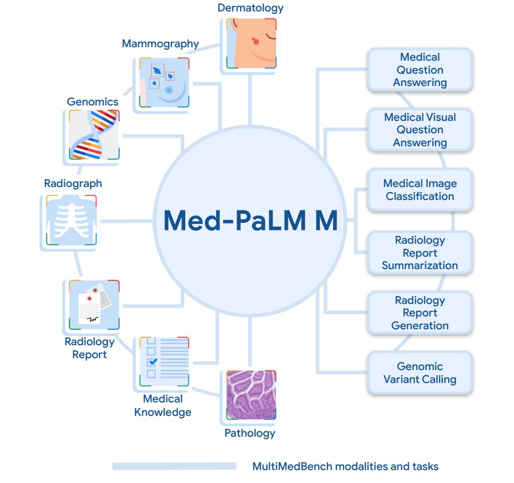

[](https://discord.gg/qUtxnK2NMf)


# Med-PaLM 
A responsible path to generative AI in healthcare: Unleash the power of Med-PaLM 2 to revolutionize medical knowledge, answer complex questions, and enhance healthcare experiences with accuracy, safety, and equitable practices.

[](https://github.com/kyegomez/Med-Palm/issues) 
[](https://github.com/kyegomez/Med-Palm/network) 
[](https://github.com/kyegomez/Med-Palm/stargazers) [](https://github.com/kyegomez/Med-Palm/blob/master/LICENSE)
[](https://twitter.com/intent/tweet?text=Excited%20to%20introduce%20Med-Palm,%20the%20all-new%20robotics%20model%20with%20the%20potential%20to%20revolutionize%20automation.%20Join%20us%20on%20this%20journey%20towards%20a%20smarter%20future.%20%23RT1%20%23Robotics&url=https%3A%2F%2Fgithub.com%2Fkyegomez%2FMed-Palm)
[](https://www.facebook.com/sharer/sharer.php?u=https%3A%2F%2Fgithub.com%2Fkyegomez%2FMed-Palm)
[](https://www.linkedin.com/shareArticle?mini=true&url=https%3A%2F%2Fgithub.com%2Fkyegomez%2FMed-Palm&title=Introducing%20Med-Palm%2C%20the%20All-New%20Robotics%20Model&summary=Med-Palm%20is%20the%20next-generation%20robotics%20model%20that%20promises%20to%20transform%20industries%20with%20its%20intelligence%20and%20efficiency.%20Join%20us%20to%20be%20a%20part%20of%20this%20revolutionary%20journey%20%23RT1%20%23Robotics&source=)

[](https://www.reddit.com/submit?url=https%3A%2F%2Fgithub.com%2Fkyegomez%2FMed-Palm&title=Exciting%20Times%20Ahead%20with%20Med-Palm%2C%20the%20All-New%20Robotics%20Model%20%23RT1%20%23Robotics) [](https://news.ycombinator.com/submitlink?u=https%3A%2F%2Fgithub.com%2Fkyegomez%2FMed-Palm&t=Exciting%20Times%20Ahead%20with%20Med-Palm%2C%20the%20All-New%20Robotics%20Model%20%23RT1%20%23Robotics)
[](https://pinterest.com/pin/create/button/?url=https%3A%2F%2Fgithub.com%2Fkyegomez%2FMed-Palm&media=https%3A%2F%2Fexample.com%2Fimage.jpg&description=Med-Palm%2C%20the%20Revolutionary%20Robotics%20Model%20that%20will%20Change%20the%20Way%20We%20Work%20%23RT1%20%23Robotics)
[](https://api.whatsapp.com/send?text=I%20just%20discovered%20Med-Palm,%20the%20all-new%20robotics%20model%20that%20promises%20to%20revolutionize%20automation.%20Join%20me%20on%20this%20exciting%20journey%20towards%20a%20smarter%20future.%20%23RT1%20%23Robotics%0A%0Ahttps%3A%2F%2Fgithub.com%2Fkyegomez%2FMed-Palm)




## Getting Started

```
pip install MedPalm
```

## Usage


```python
import torch
from medpalm.model import MedPalm

#usage
img = torch.randn(1, 3, 256, 256)
text = torch.randint(0, 20000, (1, 4096))

model = MedPalm()
output = model(img, text)
print(output.shape)
```
📝 Note: Modify the examples to suit your data and project needs.

## 📚 Datasets 
Here is a comprehensive markdown table containing metadata and details for all the datasets mentioned in the MED PALM paper

| Dataset | Modality | Description | # Training examples | # Test examples | Tasks |
|-|-|-|-|-|-|
| MultiMedBench | Multimodal | Benchmark for biomedical AI | | | 14 biomedical tasks |
| MedQA | Text | US licensing exam questions | 10,178 | 1,273 | Question answering |
| MedMCQA | Text | Indian medical exam questions | 182,822 | 4,183 | Question answering |
| PubMedQA | Text | Biomedical literature questions | 0 | 500 | Question answering |  
| MIMIC-III | Radiology reports | Radiology reports for ICU patients | 58,405 reports | 13,057 reports | Report summarization |
| VQA-RAD | Radiology images | QA pairs on radiology images | 1,797 QA pairs | 451 QA pairs | Visual question answering |
| Slake-VQA | Radiology images | English-Chinese QA pairs | 9,849 samples | 2,070 samples | Visual question answering |
| Path-VQA | Pathology images | QA pairs on pathology images | 19,755 QA pairs | 6,761 QA pairs | Visual question answering |
| MIMIC-CXR | Chest X-ray | Images and reports | 353,542 | 4,834 | Report generation, classification |  
| PAD-UFES-20 | Dermatology images | Skin lesion smartphone images | 1,838 images | 460 images | Image classification |
| CBIS-DDSM (mass) | Mammography | Mammogram mass patches | 1,318 images | 378 images | Image classification |
| CBIS-DDSM (calcification) | Mammography | Mammogram calcification patches | 1,544 images | 326 images | Image classification |
| VinDr-Mammo | Mammography | Mammogram studies | 16,000 images | 4,000 images | Image classification |
| PrecisionFDA (training) | Genomics | Genomic variant images | 197,038 images | | Image classification |
| PrecisionFDA (evaluation) | Genomics | Genomic variant images | | 13,030 images | Image classification |
| Montgomery County | Chest X-ray | Chest X-rays | 0 | 138 images | TB detection evaluation |  
| MIMIC-CXR (human evaluation) | Chest X-ray | Chest X-ray images and reports | | 246 cases | Human evaluation |

---

## 💼 Commercial Use-Cases

Med Palm has thousands of potential use cases the 3 below are simple, for more detailed applications check out my new blog article on MedPalm's use in the real world. [Click here to learn more](https://medium.com/@kyeg/how-medpalm-is-revolutionizing-medicine-62eef979f0e5)

- **Clinical Diagnostics**: Combining medical imaging, patient tales 📖, and genes, we're aiming for top-notch diagnostic solutions.
  
- **Healthcare Research**: Dive deep into diverse datasets and discover something new with Med-PaLM by your side! 🤿
  
- **Telemedicine**: Quick, reliable, and remote! 🌍 Med-PaLM's here to revolutionize telehealth.

# Contributing to Med Palm 🤖🌟
Help with the todo list!

----

## License

Med-PaLM's is under the MIT license. Check out the details [here](LICENSE.md).

## Citation
```bibtex
@misc{2307.14334,
Author = {Tao Tu and Shekoofeh Azizi and Danny Driess and Mike Schaekermann and Mohamed Amin and Pi-Chuan Chang and Andrew Carroll and Chuck Lau and Ryutaro Tanno and Ira Ktena and Basil Mustafa and Aakanksha Chowdhery and Yun Liu and Simon Kornblith and David Fleet and Philip Mansfield and Sushant Prakash and Renee Wong and Sunny Virmani and Christopher Semturs and S Sara Mahdavi and Bradley Green and Ewa Dominowska and Blaise Aguera y Arcas and Joelle Barral and Dale Webster and Greg S. Corrado and Yossi Matias and Karan Singhal and Pete Florence and Alan Karthikesalingam and Vivek Natarajan},
Title = {Towards Generalist Biomedical AI},
Year = {2023},
Eprint = {arXiv:2307.14334},
}
```

## Todo
- [ ] Implement a training script using Huggingface's accelerate and deepspeed
